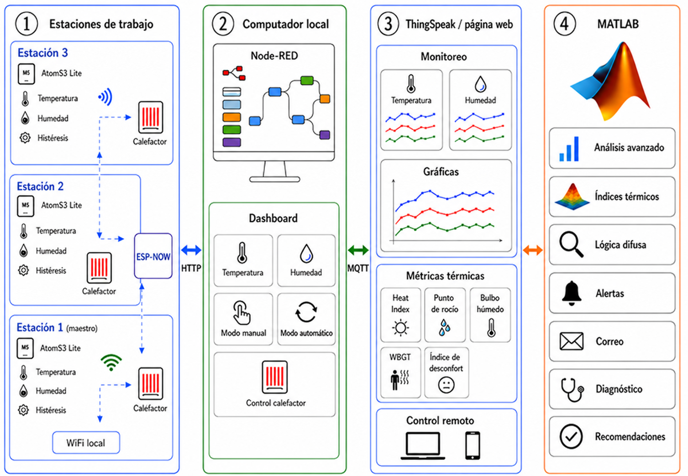

<div align="center">

# 🌡️ Sistema IoT Multiestación para Supervisión de Confort Térmico con Lógica Difusa

### ATOM S3 Lite · ESP-NOW · MQTT · Node-RED · ThingSpeak · MATLAB Analytics


</div>

---

## 📌 Descripción del Proyecto

<p align="justify">
Este proyecto presenta el diseño e integración de un sistema IoT multiestación para el monitoreo y control térmico de tres estaciones de trabajo con condiciones ambientales diferenciadas. Cada estación incorpora un nodo M5Stack AtomS3 Lite, un sensor DHT22, un módulo de relé y un calefactor independiente. El control local se ejecuta mediante una estrategia de histéresis implementada en cada nodo, mientras que la supervisión remota puede realizarse desde un dashboard desarrollado en Node-RED o mediante una página web conectada a ThingSpeak.
</p>

<p align="justify">
Los nodos intercambian información mediante ESP-NOW, permitiendo que únicamente el nodo maestro mantenga conexión con la red WiFi local y actúe como pasarela entre la red inalámbrica de estaciones y Node-RED mediante comunicación HTTP bidireccional. A su vez, Node-RED sincroniza datos y comandos con ThingSpeak utilizando MQTT bidireccional, lo que permite supervisar temperatura, humedad, estado del calefactor, modo de operación, gráficas temporales e indicadores térmicos por estación.
</p>

<p align="justify">
La plataforma incorpora análisis automático en MATLAB cada 15 minutos para calcular indicadores térmicos como Heat Index, punto de rocío, temperatura de bulbo húmedo estimada, WBGT estimado e índice de disconfort. Estos indicadores se combinan con tendencia temporal y exposición reciente mediante lógica difusa para clasificar el nivel de riesgo térmico, mostrar alertas y enviar reportes por correo electrónico por estación. El resultado es una arquitectura modular, replicable y orientada a la supervisión térmica simultánea de múltiples puestos de trabajo.
</p>

---

## 🖼️ Componentes del Sistema

<p align="center">
  
</p>

---

## 🎥 Videos Demostrativos

<table>
<tr>

<td align="center" width="33%">

### ▶️ Estación 1  
**Nodo Maestro**

<a href="https://www.youtube.com/shorts/dlZtpzraf4g">
  
</a>

[Ver video](https://www.youtube.com/shorts/dlZtpzraf4g)

</td>

<td align="center" width="33%">

### ▶️ Estación 2  
**Nodo Esclavo**

<a href="https://www.youtube.com/shorts/fxgREKSWUAM">
  
</a>

[Ver video](https://www.youtube.com/shorts/fxgREKSWUAM)

</td>

<td align="center" width="33%">

### ▶️ Estación 3  
**Nodo Esclavo**

<a href="https://www.youtube.com/shorts/SZaQv0HgcMM">
  
</a>

[Ver video](https://www.youtube.com/shorts/SZaQv0HgcMM)

</td>

</tr>
</table>

---

## ⚙️ Arquitectura del Sistema

```text
        ┌────────────────────┐
        │   Estación 1       │
        │ AtomS3 + DHT22     │
        │ Relé + Calefactor  │
        └─────────┬──────────┘
                  │
                  │ ESP-NOW
                  ▼
        ┌────────────────────┐
        │   Nodo Maestro     │
        │ AtomS3 + WiFi      │
        │ HTTP Bidireccional │
        └─────────┬──────────┘
                  │
                  │ HTTP
                  ▼
        ┌────────────────────┐
        │      Node-RED      │
        │ Dashboard + Control│
        └─────────┬──────────┘
                  │
                  │ MQTT
                  ▼
        ┌────────────────────┐
        │     ThingSpeak     │
        │ Cloud + Web + API  │
        └─────────┬──────────┘
                  │
                  │ MATLAB Analysis
                  ▼
        ┌────────────────────┐
        │  Alertas y Reportes│
        │  Riesgo Térmico    │
        └────────────────────┘
